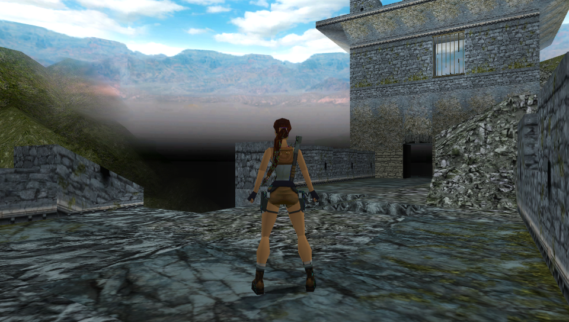

# Tomb Raider 1 & 2 Classic Collection

<p align="center"></p>

This is a wrapper/port of <b>Tomb Raider 1 Classic</b> and <b>Tomb Raider 2 Classic</b> for the *PS Vita*.

The port works by loading the official Android ARMv7 executables in memory, resolving their imports with native functions and patching them in order to properly run.
By doing so, it's basically as if we emulate a minimalist Android environment in which we run natively the executables as they are.

## Changelog

### v.1.2

- Added multilanguage (English, Italian, German, French, Spanish, Portuguese (BR), Portuguese (PT)) for Tomb Raider 2.
- Updated to latest vitaGL commit.

### v.1.1

- Added trophies support.
- Updated to latest vitaGL commit.

### v.1.0.1

- Added front touch mapping for L2/L3/R2/R3 on non PSTV devices.

### v.1.0

- Initial release.

## Disclaimer

At the time of writing this readme, both games are delisted from the major Android storefronts. This loader ("port") is intended to be used only by those people who bought the game prior to the delisting and still can legally access their own copy through the Purchased Apps list on Google Play.

Do not ask how to acquire the game data in any other way: we do not promote or condone piracy of any kind.

## Setup Instructions (For End Users)

This port supports Tomb Raider 1 Classic and Tomb Raider 2 Classic. <b>The instructions reported here will follow how to install Tomb Raider 1 Classic</b>.

The port has been tested with the following game versions:
```
  Tomb Raider 1 v.1.0.27RC1 (Has some minor issues)
  Tomb Raider 1 v.1.0.42RC1
  Tomb Raider 2 v.1.0.50RC1
```

In order to install Tomb Raider 2 Classic, just follow the same instructions but, when in the guide the word `tombraider1` is referred, change it to `tombraider2`.

- Install [kubridge](https://github.com/TheOfficialFloW/kubridge/releases/) and [FdFix](https://github.com/TheOfficialFloW/FdFix/releases/) by copying `kubridge.skprx` and `fd_fix.skprx` to your taiHEN plugins folder (usually `ux0:tai`) and adding two entries to your `config.txt` under `*KERNEL`:
  
```
  *KERNEL
  ux0:tai/kubridge.skprx
  ux0:tai/fd_fix.skprx
```

**Note** Don't install fd_fix.skprx if you're using rePatch plugin

- **Optional**: Install [PSVshell](https://github.com/Electry/PSVshell/releases) to overclock your device to 500Mhz.
- Install `libshacccg.suprx`, if you don't have it already, by following [this guide](https://samilops2.gitbook.io/vita-troubleshooting-guide/shader-compiler/extract-libshacccg.suprx).
- Obtain your copy of *Tomb Riader 1 Classic* legally for Android in form of an `.apk` file. [You can get all the required files directly from your phone](https://stackoverflow.com/questions/11012976/how-do-i-get-the-apk-of-an-installed-app-without-root-access) or by using an apk extractor you can find in the play store. The apk can be extracted with whatever Zip extractor you prefer (eg: WinZip, WinRar, etc...) since apk is basically a zip file. You can rename `.apk` to `.zip` to open them with your default zip extractor.
- Open the apk with your zip explorer and extract the file `libmain.so` from the `lib/armeabi-v7a` folder to `ux0:data/tombraider/tombraider1`.
- Extract the content of `assets` folder inside `ux0:data/tombraider/tombraider1`.
- Download `datafiles.zip` from the Release tab of this repository and extract it in `ux0:data`.
- (Optional to get FMVs working) Download [ffmpeg](https://ffmpeg.org/) and extract `ffmpeg.exe` from the `bin` folder in `ux0:data/tombraider`.
- (Optional to get FMVs working) Run `ux0:data/tombraider/transcode_tombraider1.bat`.

## Build Instructions (For Developers)

In order to build the loader, you'll need a [vitasdk](https://github.com/vitasdk) build fully compiled with softfp usage.  
You can find a precompiled version here: https://github.com/vitasdk/buildscripts/actions/runs/1102643776.  
Additionally, you'll need these libraries to be compiled as well with `-mfloat-abi=softfp` added to their CFLAGS:

- [SDL2_vitagl](https://github.com/Northfear/SDL/tree/vitagl)

- [libmathneon](https://github.com/Rinnegatamante/math-neon)

  - ```bash
    make install
    ```

- [vitaShaRK](https://github.com/Rinnegatamante/vitaShaRK)

  - ```bash
    make install
    ```

- [kubridge](https://github.com/TheOfficialFloW/kubridge)

  - ```bash
    mkdir build && cd build
    cmake .. && make install
    ```

- [vitaGL](https://github.com/Rinnegatamante/vitaGL)

  - ````bash
    make SOFTFP_ABI=1 PHYCONT_ON_DEMAND=1 NO_DEBUG=1 install
    ````

After all these requirements are met, you can compile the loader with the following commands:

```bash
mkdir build && cd build
cmake .. && make
```

## Credits

- TheFloW for the original .so loader.
- CatoTheYounger for the screenshots and for testing the homebrew.
- Once13one for the Livearea assets.
- Northfear for the SDL2 fork with vitaGL as backend.
